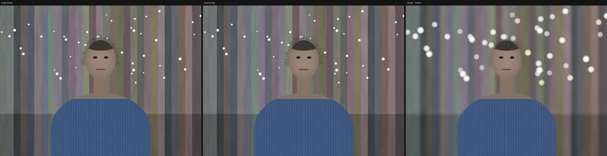
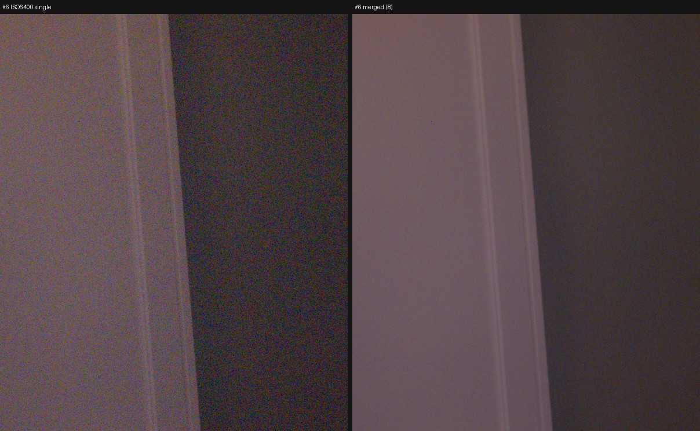
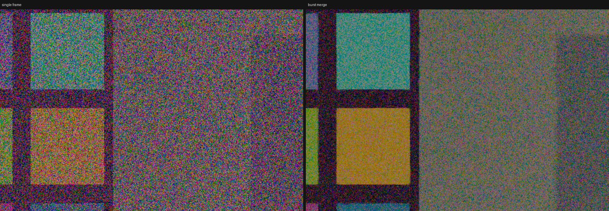
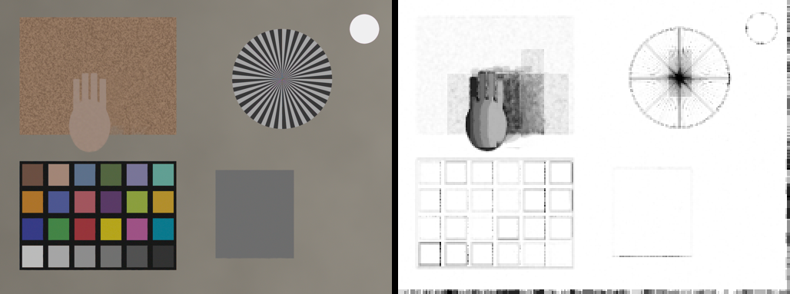

# burstpipe

RAW 버스트 HDR(HDR+ 방식 정렬·강건 합성) + 온디바이스 세그멘테이션 인물모드 파이프라인. C++17, camera HAL 아래 계층.
대상 기기 Galaxy C55 (Snapdragon 7 Gen 1). **현재 단계: 에뮬레이션 완성 + Galaxy C55 실측 완료** — 아래 모든 숫자는 출처가 표시돼 있다.


*[PC-emu] 센서 에뮬레이터 인물 세트 4080×3060 × 8장. 단일 프레임 | 8장 합성 | 합성 + 세그 마스크 보케*

## 숫자

| 항목 | 값 | 출처 |
|---|---|---|
| SNR 이득 (8장, 평탄 영역) | **9.6 dB** (이론 √8 = 9.03) | PC-emu |
| 삼각대 합성 RMSE vs 노이즈 없는 정답 | 4.55 → **1.65 DN** (8장 평균 이론치) | PC-emu |
| 움직임 영역 가중치 / 나머지 | 0.60 / 0.92, 고스트 없음 | PC-emu |
| 세그멘테이션 대기 (임계 경로) | **0.0 ms** (지연 40 ms를 넣어도 합성 뒤에 숨음) | PC-emu |
| 스레드 스케일링 (x64) | 1→4스레드 2.9배, 1→8 5.0배 | PC-emu |
| NEON vs scalar | 전체 파이프라인 출력 bit-exact | AVD arm64 |
| Camera2 RAW 버스트 → JNI → JPEG | 동작 (드롭 0, 타임스탬프 매칭 8/8) | AVD |
| 12MP×8 합성 (NEON, big 4코어) | **295 ms** (scalar 1스레드 1425 ms) | **C55** |
| 앱 셔터→JPEG (연속 5회) | **1.04–1.14 s** | **C55** |
| SNR 이득, 실제 장면 | 정적 핸드헬드 **8.1 dB**, ISO 6400 **9.9 dB** | **C55** |
| 세그 LiteRT GPU(OpenCL) vs CPU | **19–31 ms** vs 370 ms (CPU는 합성과 big 코어 경쟁), seg_wait 0 | **C55** |
| 앱 셔터→JPEG, 인물모드(보케 포함) | **1.24–1.32 s** | **C55** |

전체 표와 해석: [docs/measurements.md](docs/measurements.md)


*[C55] 인물: 8장 합성 | 세그 마스크(GPU, 가이디드 필터 정제) | 보케*


*[C55] 손 흔들기: 단일 frame 0 | 8장 합성(가장 선명한 프레임 참조, 고스트 없음) | 합성 가중치*


*[C55] ISO 6400 1/30s 크롭: 단일 | 8장 합성*


*[PC-emu] 저조도(ISO 3200) 크롭: 단일 | 8장 합성*


*[PC-emu] 움직임 세트: 합성 결과(손에 고스트 없음) | 합성 가중치 맵(검정 = 거부). 스타/차트 엣지의 회색은 정수 정렬의 서브픽셀 잔차*

## 구조

```
Kotlin 앱 (Activity 1개, Camera2 RAW 버스트, 덤프/처리/EMU 버튼)
   │ JNI: direct ByteBuffer RAW16 × N + meta 문자열 → 복사 없이 Image<uint16_t>
core/ (순수 C++17, Android 의존 없음 — PC·arm64 동일 코드)
   Pipeline::run
     ├─ [세그 스레드] RAW→256² RGB → Segmenter(LiteRT CPU/GPU | emu) ──────────────┐
     ├─ gray 피라미드 → 참조 선택 → 타일 정렬(coarse-to-fine, SAD, NEON)            │
     ├─ 강건 합성 (겹침 raised-cosine 타일, 노이즈 모델 가중치, 후보 모션 재평가, NEON) │
     ├─ 마무리 (블랙/WB/클립 → bilinear 디모자이크 → CCM → Reinhard → sRGB)         │
     └─ 보케: 마스크 ← 합류(seg_wait) → 가이디드 필터 → 하이라이트 부스트 → (1−α) 정규화 디스크 블러 → 합성
emu/ (core가 모르는 에뮬레이션 계층)
   SensorEmu: 장면 → CCM⁻¹ → WB⁻¹ → EV−1.5 → Bayer → σ²=a·x+b 노이즈 → 10bit,  손떨림/움직임/저조도/인물+GT
```

설계 결정: core/는 Android를 모른다 → PC에서 알고리즘, 같은 cli를 arm64로 빌드해 `adb shell`로 측정, 앱은 마지막.
세그는 frame 0 RAW 축소본을 입력으로 받아 정렬·합성과 병렬. scalar 참조 구현은 NEON의 정답지로 남긴다.

## 무엇을 어떻게 고쳤나 (에뮬레이션 단계에서 찾은 것)

1. **합성 번짐**: 합성 타일(Bayer 32, stride 16)이 정렬 타일(gray 16) 두 개에 걸치는데 중심 타일의 err만 쓰면, 평탄한 조명 내부에서 노이즈로 정해진 엉뚱한 모션이 옆 엣지에 적용돼 조명 밝기가 벽으로 +450 DN 번졌다. 겹치는 정렬 타일 모션(최대 4개)을 후보로 합성 footprint 전체 SAD가 최소인 것을 고르고 그 SAD로 가중치 → 삼각대 RMSE 4.58 → 1.65 DN.
2. **HAL 노이즈 프로파일 신뢰성**: Android 에뮬레이터 HAL이 `noise_profile a=1.0`을 준다 → 모든 타일이 "노이즈 이내"라 고스트 거부가 꺼짐(mean_weight 0.999). 범위 검사 후 정렬 오차 중앙값 추정으로 대체 → 0.815.
3. **하이라이트 분홍**: G가 포화한 광원에서 R/B만 WB 게인만큼 커져 마젠타 → WB 후 1.0 클립.
4. **스레드풀 레이스**: 늦게 깬 워커가 다음 `parallel_for`의 인덱스를 이전 fn으로 소비할 수 있었다 → 매 generation 전 워커 체크인 (20000회 스트레스 테스트).
5. **(C55) MediaPipe 커스텀 op**: `Convolution2DTransposeBias`를 C API로 직접 구현·등록 (GPU 내장 구현과 마스크 IoU 0.998).
6. **(C55) 센서 방향**: 모델이 옆으로 누운 사람을 받아 상체만 검출 → 정립 회전 후 마스크 역회전, 전경 2.9% → 15.2%.
7. **(C55) GPU 델리게이트 스레드 친화성**: 앱에서만 추론 실패(보케가 조용히 꺼짐) → 델리게이트 전용 소유 스레드.
8. **(C55) 결과 CCM 단위행렬** → ForwardMatrix로 CCM 계산. **앱 OpenCL 폴백** → `uses-native-library`.
9. 개발문서의 정렬 테스트 텍스처 `((x/8)*73+(y/8)*151)%11`은 (32,16)px 주기 격자라 거친 단에서 가짜 정합 → 비주기 랜덤 블록으로 교체.

## 빌드·실행

```bash
# PC (Windows면 WSL2 Ubuntu)
bash scripts/test_pc.sh               # 빌드 + 테스트 7개
bash scripts/emu_bursts.sh full       # 에뮬 버스트 5세트 → bursts/emu_*
bash scripts/run_emu_demo.sh          # 결과 이미지·SNR·IoU → out/
bash scripts/bench_pc.sh              # 스레드 스윕 표

# arm64 / Android 에뮬레이터
NDK=... bash scripts/build_arm64.sh                  # ABI=x86_64, NO_NEON=1 옵션
ADB=... bash scripts/bench_device.sh bursts/emu_portrait_half --threads 4 --seg-model emu_portrait_half/mask_emu.bin --delegate emu
cd android && ./gradlew assembleDebug && cd ..
ADB=... bash scripts/app_emu_test.sh                 # 앱 설치 → EMU/DUMP/SHOOT 자동 실행 → out/device_dump
```

cli: `burstpipe_cli --in DIR --out out.ppm [--frames N --threads T --cpus 4,5,6,7 --mask m.bin | --seg-model M --delegate cpu|gpu|emu] [--json t.json --dump-merged --dump-weights --dump-alpha]`

덤프 형식 (`bursts/<name>/`): `frame_NN.raw16`(W×H uint16 LE) + `meta.txt` (width/height/cfa/white_level/black_level/wb_gains/ccm/noise_profile/frame 줄). 에뮬 세트는 추가로 `truth.txt`, `mask_emu.bin`, `alpha_gt_q.pgm`, `clean_NN.raw16`.

## 저장소

```
core/include/burstpipe/  image burst timings thread_pool align merge finish bokeh seg pipeline (.h)
core/src/                구현 + *_neon.cc + seg_litert.cc(arm64+LiteRT일 때만)
core/tests/              stage당 1개 + test_threadpool + test_pipeline(에뮬 수용 테스트)
core/cli/                burstpipe_cli
emu/                     센서 에뮬레이터 (burstpipe_emu)
android/                 Gradle 앱 (Kotlin Camera2 + jni.cc)
tools/                   view_raw snr seg_infer mask_iou compare3 plot_timings ppm2png (.py)
scripts/                 build_pc test_pc emu_bursts run_emu_demo bench_pc build_arm64 bench_device trace_device perf_device app_emu_test fetch_litert
docs/                    measurements.md, hardware_test.md, img/
```

## 하지 않은 것 / 다음 단계
- 실기기 측정 전부 → [docs/hardware_test.md](docs/hardware_test.md)
- 서브픽셀 정렬 (에뮬 정답으로 엣지 잔차가 정량화돼 있음), 주파수 영역 Wiener 합성, Malvar 디모자이크, Mertens 융합
- Vulkan 보케, QNN HTP, ADPF/서멀 N 조절, Camera2 NDK 포팅
- fp16 merge는 하지 않는다 (정밀도: measurements.md 6장)

## 참고
Hasinoff et al. 2016 *Burst photography for high dynamic range and low-light imaging on mobile cameras* (HDR+) ·
He et al. 2010 *Guided Image Filtering* · MediaPipe Selfie Segmentation · 설계 배경: `Google_Pixel카메라_burstpipe_설계.md`, 구현 계획: `Google_Pixel카메라_burstpipe_개발문서.md`
